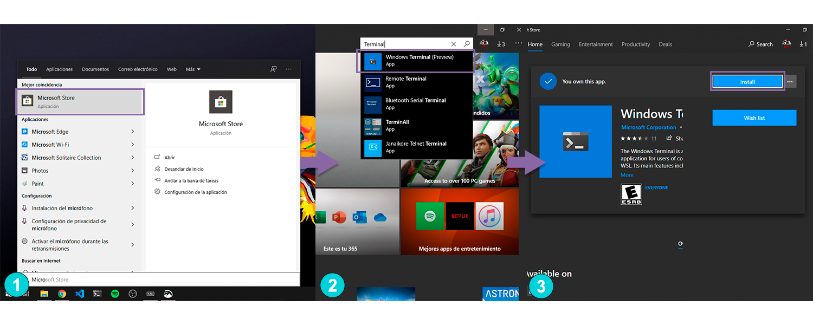
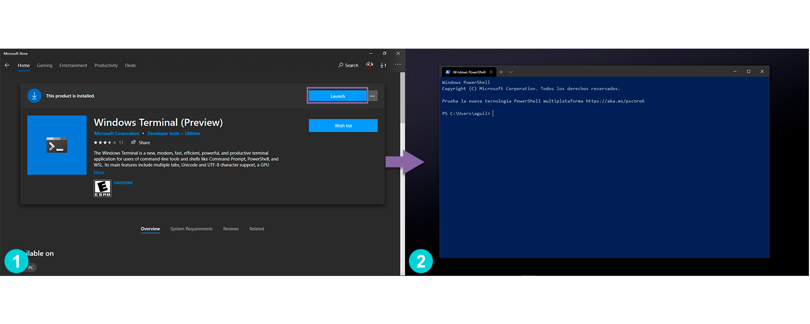
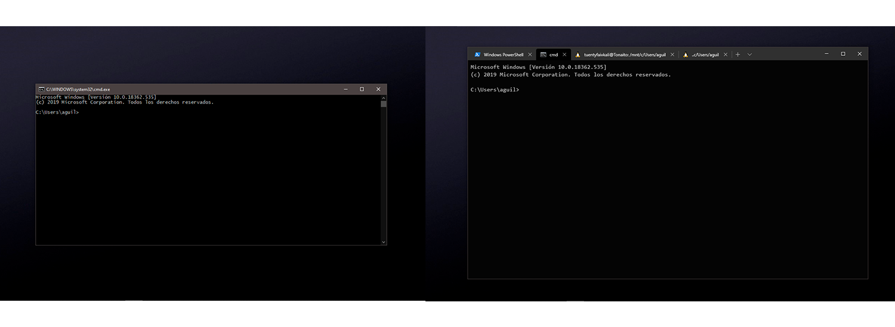
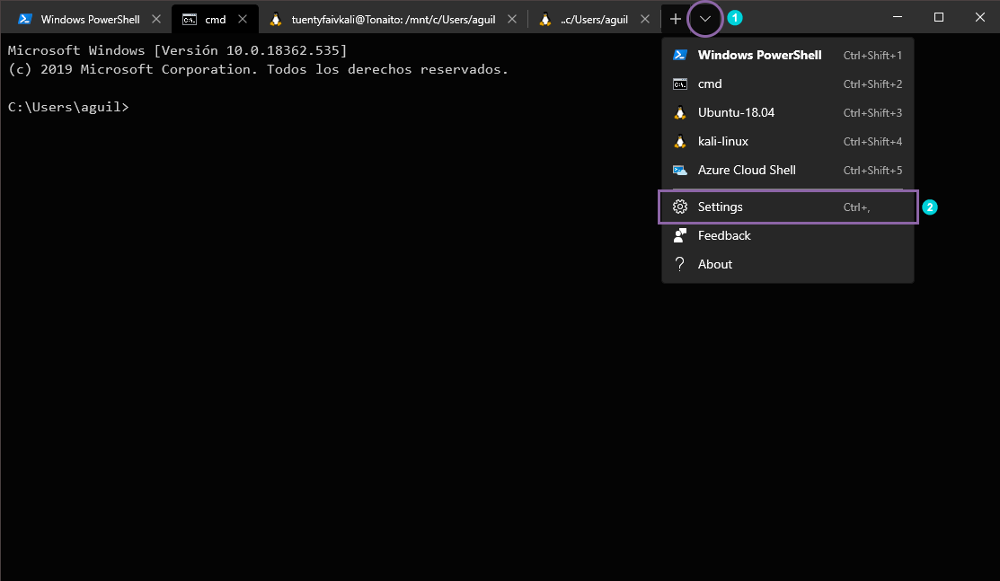
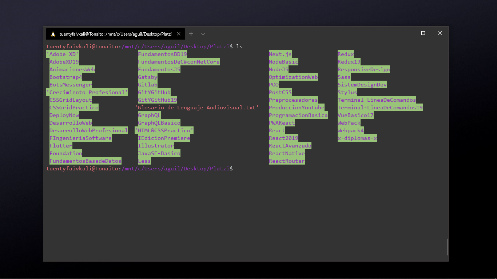
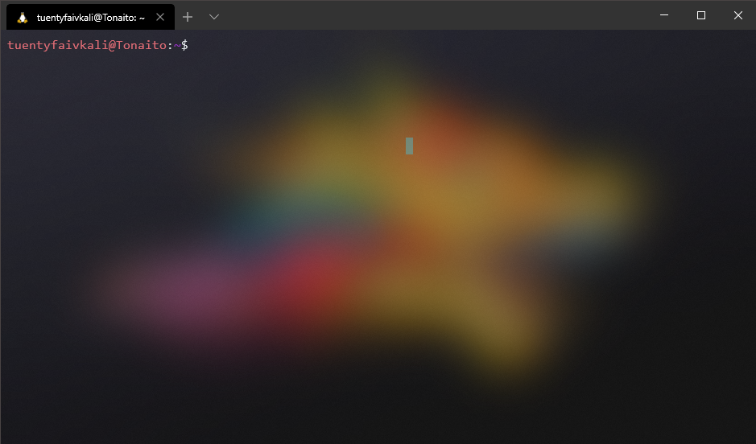
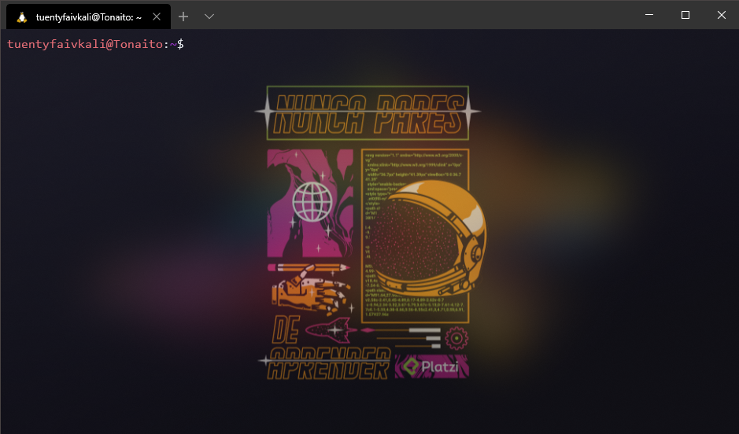
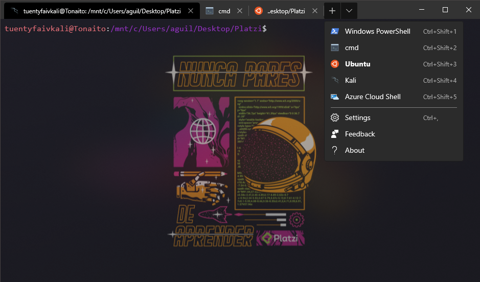

Como sabes la terminal en Windows carece de personalización por ende se ve muy soso o aburrido si la utilizas muy seguido ya sea en CMD.exe o en WSL (Windows Subsystem Linux), así que vamos a ver cómo agregarle un toque de tu personalidad.

Microsoft lanzó hace poco una terminal en la Microsoft Store donde puedes tener varias pestañas abiertas de una misma terminal o de varias, así que, si quieres abrir WSL, CMD o Power Shell ya no tienes que abrirlas por separado, además de que nos permite personalizarla fácilmente.

Veamos cómo instalarla:

- Nos dirigimos a la Microsoft Store(1), buscamos “Terminal” luego le damos click a "Windows Terminal (Preview)(2) y lo instalamos(3):


  
- Una vez instalada la abrimos(1) y nos aparecera como en la segunda imagen(2):



- Listo ya tenemos instalada la nueva terminal, A simple vista no se ve un gran cambio pero en un momento lo pondremos todo cool. Lo importante es que ahora podemos abrir cualquier terminal que tengamos instalada en una sola ventana.



## Ahora pasemos a lo divertido. ¡Personalicémosla!

Tenemos de que darle click en la flecha hacia abajo(1), como puedes ver ahí están todas las terminales que tengamos instaladas además de otras opciones como “Settings, Feedback, y About”, ahora tenemos que seleccionar “Settings”(2) para darle nuestro propio toque a cada terminal.



Se abrirá un archivo JSON con la siguiente estructura:
```json
  /* 
  To view the default settings, hold "alt" while clicking on the "Settings" button. 
  For documentation on these settings, see: https://aka.ms/terminal-documentation
  */  

  {
    "$schema": "https://aka.ms/terminal-profiles-schema",

    "defaultProfile": "{61c54bbd-c2c6-5271-96e7-009a87ff44bf}",

    "profiles":
    [
      {
        // Make changes here to the powershell.exe profile
        "guid": "{61c54bbd-c2c6-5271-96e7-009a87ff44bf}",
        "name": "Windows PowerShell",
        "commandline": "powershell.exe",
        "hidden": false
      },
      {
        // Make changes here to the cmd.exe profile
        "guid": "{0caa0dad-35be-5f56-a8ff-afceeeaa6101}",
        "name": "cmd",
        "commandline": "cmd.exe",
        "hidden": false
      },
      {
        "guid": "{c6eaf9f4-32a7-5fdc-b5cf-066e8a4b1e40}",
        "hidden": false,
        "name": "Ubuntu-18.04",
        "source": "Windows.Terminal.Wsl"
      },
      {
        "guid": "{46ca431a-3a87-5fb3-83cd-11ececc031d2}",
        "hidden": false,
        "name": "kali-linux",
        "source": "Windows.Terminal.Wsl"
      },
      {
        "guid": "{b453ae62-4e3d-5e58-b989-0a998ec441b8}",
        "hidden": false,
        "name": "Azure Cloud Shell",
        "source": "Windows.Terminal.Azure"
      }
    ],

    // Add custom color schemes to this array
    "schemes": [],

    // Add any keybinding overrides to this array.
    // To unbind a default keybinding, set the command to "unbound"
    "keybindings": []
  }
```
No te espantes, si ya tomaste el curso esto no es nada, es muy simple. Veamos para qué sirve cada propiedad:

- ### $schema:

  Se refiere a cuál será el schema que tendrá la terminal, aquí estará la dirección hacia el archivo de dicho schema que le dará funcionalidad a toda la Windows Terminal (Preview).

  Si te diriges al enlace encontrarás las especificaciones de cada una de las propiedades que están en el archivo o que se le pueden añadir, junto con lo valores que se le pueden dar. Cada uno tiene una descripción donde dice cuál es la función de dicha propiedad.

- ### defaultProfile:

  Es el perfil principal que aparecerá cuando abras la Windows Terminal (Preview), el valor de la propiedad es el identificador del perfil que quieres como principal.

  **Nota:** Windows Terminal (Preview) maneja las terminales previamente instaladas como perfiles diferentes. Por ejemplo, si tienes instalado Kali Linux y Ubuntu como en mi caso, aunque ambas son WSL las separará en dos perfiles diferentes.

- ### profiles:

  Aquí estarán todos lo perfiles como objetos dentro de un array, es decir, cada una de nuestras terminales que tengamos instaladas. Si no aparece alguna de nuestras terminales la podemos agregar creando otro objeto dentro del array. Cada objeto tiene cuatro propiedades por defecto, pero le podemos agregar más para poder personalizar cada una por separado no necesariamente todas tienen que tener el mismo tema.

  - ### guid:

      Es es el identificador único de cada perfil, también se puede utilizar para seleccionar nuestro perfil principal como se mencionó anteriormente. Te reto a que coloques el perfil de tu preferencia como principal.

  - ### name:

      Es el nombre que aparecerá en el menú desplegable justo donde está la opción de configuración.

  - ### commandline:

      Aquí estará el nombre del archivo ejecutable de la terminal que queremos que se abra al seleccionar dicho perfil.

  - ### hidden:

      Escogemos si queremos que se muestre o no en el menú desplegable. Tiene que ser un valor booleano osea “true” o “false”, **sin comillas.**

  - ### source:

      Es muy parecido a commandline pero la diferencia es que aquí no va ningun archivo ejecutable sino el perfil generado que originó este perfil. Lo sé es confuso, por el momento estamos bien sabiendo que Windows Terminal (Preview) nos lo genera automáticamente.

- ### schemes:
  
  No confundir con $schema. Es un array de objetos donde cada objeto representa un tema para la terminal, ya sea por defecto o personalizado.

  - ### name:
    
      Es el nombre que le daremos al tema, se usará para seleccionarlo posteriormente

  - ### background:
    
      Será el color de fondo que ocuparemos para este tema. El valor es hexadecimal.

  - ### foreground:
    
      Será el color de las letras del tema. El valor es hexadecimal.

  - ### selectionBackground:
    
      Será el color de selección del tema. El valor es hexadecimal.

    **Nota:** Se pueden agregar más propiedades como las siguientes: “black, blue, brightBlack, brightBlue, brightCyan, brightGreen, brightPurple, brightRed, brightWhite, brightYellow, cyan, green, purple, red, white, yellow”. Todas con el valor en hexadecimal.

- ### keybindings:
  
  Es un array de objetos donde cada objeto representa un atajo del teclado.

  - ### command:

      El comando para el atajo de teclado que se ejecutará al presionar cierta combinación de teclas. Nosotros podemos elegir qué teclas serán.

      **Los comandos pueden ser los siguientes:** “closeTab”, “closeWindow”, “copy”, “decreaseFontSize”, “duplicateTab”, “increaseFontSize”, “newTab”, “nextTab”, “openSettings”, “paste”, “prevTab”, “scrollDown”, “scrollUp”, “splitHorizontal”, “splitVertical”, “splitPane”, “toggleFullscreen”.

      Y esos no son todos, puedes buscar más en el enlace que viene en el $schema.

  - ### keys:
      
      Aquí irá la combinación de teclas que ocuparemos. Estas siempre deben comenzar por “ctrl, shift o alt” seguido de “+” y luego de la tecla siguiente a ocupar.

**¡Genial!,** Hasta ahora hemos visto las propiedades que aparecen por defecto y para qué sirve cada una junto a unas extras. Hemos aprendido a colocar un perfil como principal, hacer temas de colores y atajos de teclado personalizados.

Pero me preguntaras: ¿Eso es todo? No, eso no es todo vayamos a la parte más emocionante, ya estamos por acabar. Pero antes veamos nuestro progreso.



Por el momento hemos configurado el tema que ves en la imagen. Pero, ¿Cómo le pongo el tema que creé? Es muy sencillo, agregamos la propiedad **colorScheme** al perfil que le queremos poner el tema y su valor será igual al valor que pusimos en **name** del objeto dentro de **schemes.**

**Nota:** Todas las propiedades que se mencionan adelante irán en el objeto del perfil que queramos personalizar.
```json
{
  // Objeto del perfil
  "guid": "{46ca431a-3a87-5fb3-83cd-11ececc031d2}",
  "hidden": false,
  "name": "kali-linux",
  "source": "Windows.Terminal.Wsl",
  "colorScheme": "One Half Dark"
}
```

Ahora hagamos que el fondo sea transparente para eso usaremos las siguientes propiedades:

**useAcrylic** y **acrylicOpacity**, useAcrylic solo acepta valores booleanos true o false, y acrylicOpacity solo acepta valores del 0 al 1.

Vamos a implementarlo de la siguiente manera:
```json
{
  // Objeto del perfil
  "useAcrylic": true,
  "acrylicOpacity": 0.25
}
```

Y quedará de la siguiente manera:



Pero, ¿Y si me gusta más una imagen de fondo? Muy sencillo, las propiedades a ocupar son las siguientes:

**backgroundImage**, **backgroundImageOpacity** y **backgroundImageStretchMode**.

En backgroundImage pondremos la dirección de la imagen ya sea local o una url, en backgroundImageOpacity pondremos un valor entre 0 y 1, y en backgroundImageStretchMode pondremos algunos de estos valores: “fill”, “none”, “uniform” o “uniformToFill”.

Vamos a implementarlo de la siguiente manera:
```json
{
  // Objeto del perfil
  "backgroundImage": "dirección de la imagen",
  "backgroundImageOpacity": 0.5,
  "backgroundImageStretchMode": "uniformToFill",
}
```

Quedaría de la siguiente manera:



*Si no te gusta que sea transparente solo pon la propiedad useAcrylic en false.*

Ya casi acabamos, por último, vamos a cambiar los iconos de cada terminal y a decirle desde que directorio queremos que se abra dicha terminal.

Empecemos por cambiar los iconos, primero tenemos que tener descargados los iconos que vamos a ocupar, te recomiendo [Icons8](https://iconos8.es/) para descargar los iconos que ocuparemos, solo busca “terminal” y escoge los que más te gusten. Te recomiendo que sean de 32 pixeles.

Una vez descargados tenemos que dirigirnos al siguiente directorio y colocamos ahí los iconos descargados: `C:/Users/USUARIO_DEL_EQUIPO/AppData/Local/Packages/Microsoft.WindowsTerminal_8wekyb3d8bbwe/RoamingState/`

Ahora usaremos la siguiente propiedad:
```json
{
  // Objeto del perfil
  "icon": "ms-appdata:///roaming/NOMBRE_DEL_ARCHIVO"
}
```

Por último, solo falta configurar desde que directorio queremos que comience al abrir una terminal. Para eso colocamos lo siguiente:
```json
{
  // Objeto del perfil
  "startingDirectory": "%USERPROFILE%/Desktop/Platzi/"
}
```

Y quedaría de la siguiente manera:



## ¡Excelente!, Hemos terminado.

Has aprendido a personalizar cualquier terminal que tengas en Windows. Por cierto, todavía hay opciones por explorar, como el tamaño de fuente, el tipo de fuente, el color del cursor, el padding de la terminal y otros cuantos.

Te invito a que juegues con las configuraciones y crees tus propios temas. 